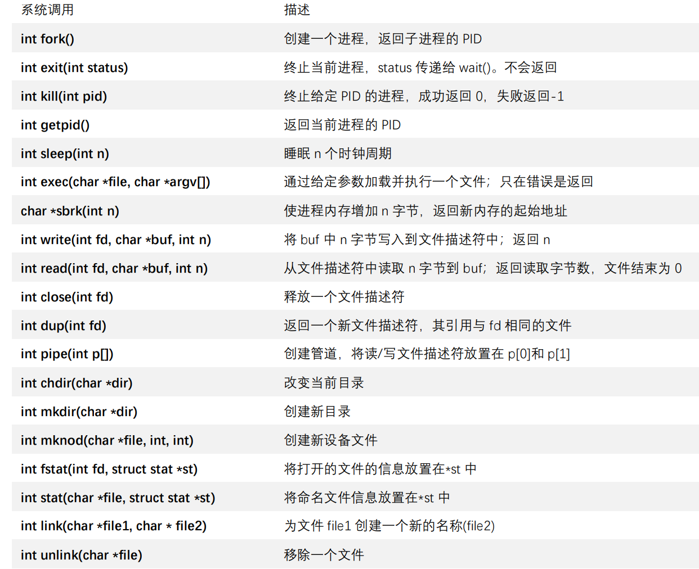
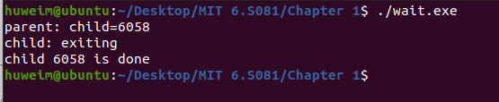

# Textbook

## Chapter 1 Operating System Interfaces

+ An operating system provides services to user programs through an **interface**.
  + 通过接口为application提供服务
+ Each running program, called a process, has memory containing instructions, data, and a stack.
  + 每个正在运行的程序，称为进程
  + 当一个进程需要调用一个内核服务时，它就会invokes a **system call**，这是操作系统接口中的一 个调用。
+ 


### 1.1 Processes and memory

+ 个人理解，在本章中涉及到的一些system call function，首先要有一定的概念，看到就知道这是系统调用函数。然后需要用到时再去查找他们的作用，返回值等等。

#### I. Basic

+ xv6 process consists of
  + user-space memory (instructions, data, and stack)
  + per-process state private to the kernel
    + 内核私有的进程状态
+ The kernel associates a process identifier, or PID, with each process.
  + 内核为每个进程关联一个 PID(进程标识符)。

#### II. `fork` creates child process

+ 可以使用 fork 系统调用创建一个新的进程。
+ Fork 创建的新进程，称为子进程，其内存内容与调用的进程完全相同，原进程被称为父进程。
+ difference of **return** value
  + in parent process，fork return the PID of child process
  + in child process，fork return 0。
+ ⭐理解了一些
  + fork 创建了新的进程，fork() sys call 在两个一模一样的进程中都会返回。initial return pid of new, new return. 
  + 因此，即使两个进程内存一样，还是可以通过返回值区分。
  + fork() sys call, 两个进程在同时运行，输出交织在一起。
    + 脑海中要有进程并行运行的概念
+ Q: fork产生的子进程是不是总是与父进程是一样的？它们有可能不一样吗？
  + A: 在XV6中，除了fork的返回值，两个进程是一样的。两个进程的指令是一样的，数据是一样的，栈是一样的，同时，两个进程又有各自独立的地址空间，它们都认为自己的内存从0开始增长，但这里是不同的内存。 
  + 在一个更加复杂的操作系统，有一些细节我们现在并不关心，这些细节偶尔会导致父子进程不一致，但是在XV6中，父子进程除了fork的返回值，其他都是一样的。

#### III. `exit` terminates current process

+ stops executing and release resources (memory and opened file).
  + 释放资源
+ `exit(0)` indicates success, `exit(1)` indicates failure.
  + exit 需要一个整数状 态参数，通常 0 表示成功，1 表示失败

#### IV. `wait`

+ returns the PID of an exited(or killed) child, if none exited, it keeps waiting

+ **return value** 
  + wait 系统调用返回当前进程的一个已退出（或被杀死）的子进程的PID，并将该子进程的退出状态码复制到一个地址，该地址由 wait 参数提 供；
  + no children: returns -1

+ doesn't care about the exit status: `wait((int*)0)`

+ ```c++
  #include <iostream>
  #include<unistd.h>
  #include "sys/wait.h"
  #include "sys/types.h"
  int main(){
      int pid = fork();
      if (pid > 0)
      {
      printf("parent: child=%d\n", pid);
      pid = wait((int *)0);
      printf("child %d is done\n", pid);
      }
      else if (pid == 0)
      {
      printf("child: exiting\n");
      exit(0);
      }
      else
      {
      printf("fork error\n");
      }
      return 0;
  }
  ```




#### V. echo

+ echo是一个非常简单的命令，它接收任何你传递给它的输入，并将输入写到输出


### 1.2 I/O and File descriptors

#### I. file descriptor

+ File descriptors Def:
  + A file descriptor is a small integer representing a kernel-managed object that a process may read from or write to.
  + 文件描述符是一个小整数，代表一个可由进程读取或写入的内核管理对象。

#### II. Read and Write

+ `read(fd,buf,n)` reads `fd` at address `buf` of size `n`
  + 调用 read(fd, buf, n)从文 件描述符 fd 中读取不超过 n 个字节的数据，将它们复制到 buf 中，并返回读取的字节数。
+ `write(fd,buf,n)` writes `fd` at address `buf` of size `n`
  + write(fd, buf, n)表示将buf 中的 n 个字节写入文件描述符 fd 中，并返回写入的字节数。 若写入字节数小于 n 则该次写入发生错误。
+ close 系统调用会释放一个文件描述符，使它可以被以后的 open、pipe 或 dup 系统调 用所重用（见下文）。

#### III. why `exec` and `fork` are seperate?

+ redirect the child’s I/O without disturbing the I/O setup of the main shell
  + 在这两个调用之间，shell 有机会重定 向子进程的 I/O，而不干扰父进程的 I/O 设置。
+ ???????????这个part不是特别理解

### 1.3 Pipes

+ A pipe is a small kernel buffer exposed to processes as a pair of file descriptors, one for reading and one for writing.
  + one for read, one for write

##### I. how is `pipe` executed?

+ The child process creates a pipe to connect the left end of the pipeline with the right end. Then it calls `fork` and `runcmd` for the left end of the pipeline and fork and runcmd for the right end, and waits for both to finish
  + 连接管线的左端和右端？
  + not understand

### 1.4 File System

+ A path like /a/b/c refers to the file or directory named c inside the directory named b inside the directory named a in the root directory /.

##### I. Operation

+ There are system calls to create new files and directories
  + `mkdir` creates a new directory
  + `open` with the `O_CREATE` flag creates a new data file
  + `mknod` creates a new device file
+ `inode` - the entity of file, `links` - file name, one file can have multiple names. An inode holds `metadata` about a file, including type (file or directory or device), length, location and the number of links to a file.
+ `link` links file name to a file.
+ `unlink` unlinks the file name.

##### II. why `cd` is embedded in the shell

+ `cd` is an exception. If `cd` were run as a regular command, then the shell would fork a child process, the child process would run `cd`, and `cd` would change the child ’s working directory. The parent’s (i.e., the shell’s) working directory would not change.

+ 笔记参考：
  + [https://github.com/philoinovsky/MIT_OS]
  + [https://github.com/pleasewhy/xv6-book-2020-Chinese]

