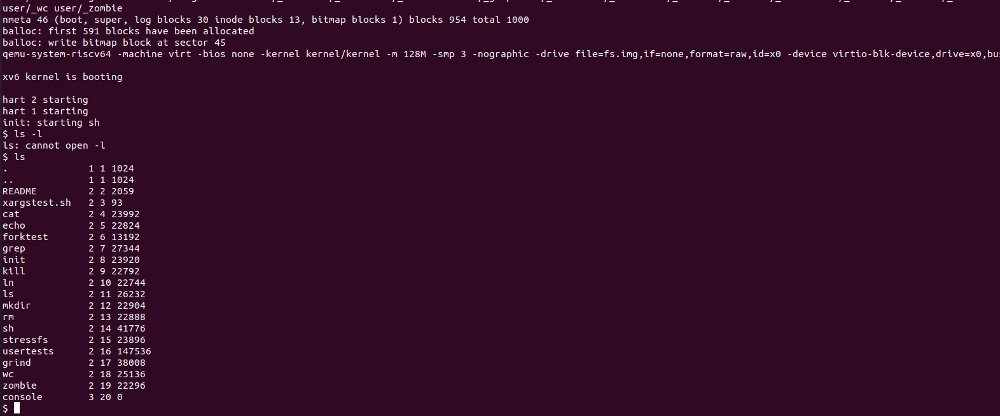
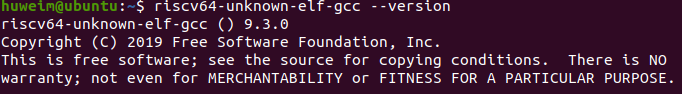

这学期开始的CA III课程需要使用到OS的部分知识，正好借这个机会补一下一直想学但没有系统学过的OS课程。选择跟随MIT的6.S081，并记录做Lab的过程以及一些笔记，也会分享过程中自己遇到的坑。

## 课程主页概览

### Overview

课程主要是讲述操作系统的设计和实现，and their use as a foundation for systems programming。包含了virtual memory; file systems; threads; context switches; kernels; interrupts; system calls; interprocess communication; coordination, and interaction between software and hardware等几大主题。基于Unix v6来进行学习。

### General Information

因为是网课及自学，所以主要关心Labs和Textbook，其他可以根据Schedule自行安排。

#### Labs

Lab的环境配置在官网可以找到，`https://pdos.csail.mit.edu/6.S081/2020/tools.html`

也可以参考知乎上一些同学写的文章，避免一些配置过程中会遇到的坑。`https://zhuanlan.zhihu.com/p/343655412`

#### Textbooks

6.S081 relies on the following books:

- [xv6: A simple, Unix-like teaching operating system](https://pdos.csail.mit.edu/6.S081/2020/xv6/book-riscv-rev1.pdf) by R. Cox, F. Kaashoek, and R. Morris.
- The C programming language (second edition) by Kernighan and Ritchie. Prentice Hall, Inc., 1988. ISBN 0-13-110362-8, 1998.

## 整体思路

需要在短时间内完成，所以还是以lab为导向，参考一些同学制作的lecture中文记述`https://github.com/pleasewhy/xv6-book-2020-Chinese`，结合课程Slide先过一遍基础知识，然后开始做对应的lab。

## 环境配置

使用Ubuntu 20.04，根据知友的经验，使用20.04的版本才能正确找到package。根据官方教程安装`qemu-system-misc`	。

```
sudo apt-get install qemu-system-misc
```

之后根据官方教程进行测试

```
riscv64-unknown-elf-gcc
```

未安装则使用`sudo apt install`指令进行安装

```
sudo apt install riscv64-unknown-elf-gcc
```



同理测试和安装

```
qemu-system-risv64
```

```
sudo apt install qemu-system-risv64
```

之后克隆git仓库

```
git clone git://g.csail.mit.edu/xv6-labs-2020
cd xv6-labs-2020
git checkout util
```

然后执行命令

```
sudo make qemu
```



booting成功后完成搭建

上述过程在官方网站都能够找到`https://pdos.csail.mit.edu/6.S081/2020/labs/util.html`

